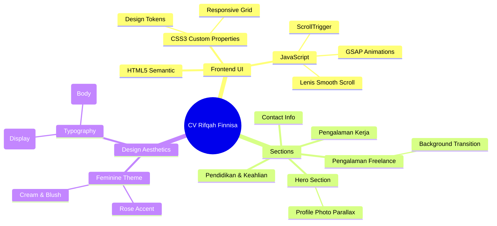

# Rifqah Finnisa - Curriculum Vitae Web

Sebuah website CV interaktif dan sinematik, didesain menggunakan **Designer Mind OS** untuk menghasilkan estetika yang elegan, hangat, dan feminin, serta didukung oleh **AEGIS Elite Cognitive Runtime**.

## 🚀 Fitur Utama
- **Cinematic Design**: Tata letak editorial dengan whitespace besar dan tipografi premium (`Syne` dan `Inter`).
- **Smooth Scrolling**: Lenis dipadukan dengan GSAP ScrollTrigger untuk interaksi yang mulus (butter scroll effect).
- **Feminine Palette**: Warna *Soft Cream*, *Blush*, *Deep Charcoal*, dan aksen *Rose/Terracotta*.
- **Dynamic Interactions**: Efek *magnetic button*, animasi transisi *background color* pada saat scroll, dan *reveal text*.

## 🗺️ Product Map

## 🛠️ Stack & Library
- **HTML5** & **CSS3**
- **GSAP 3.12.2** (Core + ScrollTrigger)
- **Lenis 1.0.33**
- **Google Fonts**

## 📜 Lisensi
Dikembangkan dengan standar operasional **AEGIS Elite Cognitive Runtime Platform**.
Hak cipta konten milik Rifqah Finnisa.
