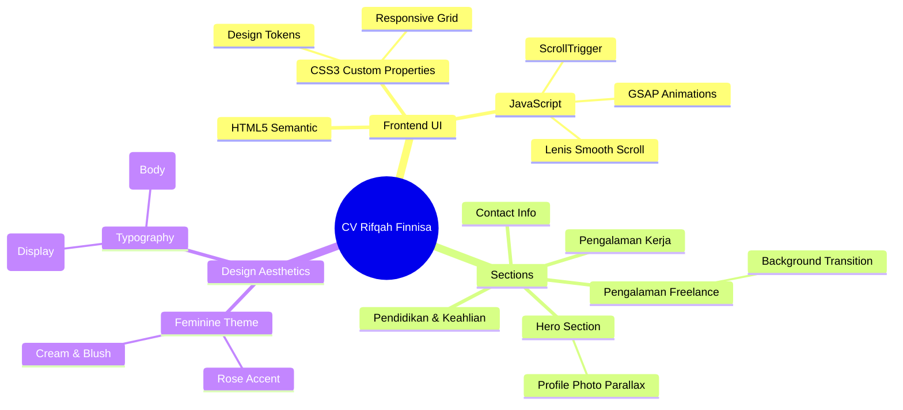

# Rifqah Finnisa - Curriculum Vitae

> **Project Officer / PIC**
> Jakarta, 07 Juli 1999 | 162 cm | 55 kg
> 📱 0838-9324-7300 | 0838-6297-7325
> ✉️ [rifqahfinnisa@gmail.com](mailto:rifqahfinnisa@gmail.com) | Instagram: [@finnisaaa](https://instagram.com/finnisaaa)
> 📍 Pondok Cabe, Tangerang Selatan

Dengan pengalaman sebagai Project Officer, PIC, Project Coordinator, Account Relationship Executive, dan Administrative Staff. Saya dapat mengembangkan kreativitas dan potensi saya untuk posisi baru yang saya jalani baik itu bekerja secara individu maupun tim.

---

## 💼 Pengalaman Kerja

### PT. Impact Power Mandiri
**Administrative Staff & Account Relationship Executive** | *Juli 2023 - Sekarang*
- Membuat dan merekap laporan penjualan harian maupun mingguan
- Merekap absen karyawan untuk perhitungan gaji
- Membuat dan merekap seluruh budget agar dapat dilakukan invoice
- Mengelola dokumen dan surat menyurat Perusahaan
- Melakukan pengarsipan data
- Mendaftarkan BPJS Kesehatan dan Ketenagakerjaan Karyawan
- Membuat strategi kampanye untuk menentukan peluang peningkatan pelayanan
- Media telemarketing perusahaan dengan menawarkan produk sebagai solusi dari pertanyaan pelanggan
- Melakukan rekap perjalanan dinas luar kota
* **Project Handle:** Blibli Mitra, Mayora, Hitachi, Nabati, Greenfields, Kalbe

### PT. Fungsi Satu Indonesia
**Project Officer / PIC** | *Agustus 2020 – Mei 2023*
- Membuat rencana project
- Merekrut manpower
- Meminimalisir masalah dan monitoring perkembangan project
- Koordinasi dengan atasan maupun client untuk perkembangan project
- Training dan memberikan arahan kepada tim untuk mencapai tujuan yang telah ditetapkan
- Melakukan visit tim/perjalanan dinas untuk monitoring kegiatan sudah berjalan sesuai SOP
* **Project Handle:** XL HOME, Axis & Mayora

### PT. Fungsi Satu Indonesia
**Project Coordinator** | *Agustus 2019 – Agustus 2020*
- Melakukan perekrutan kebutuhan sumber daya manusia
- Membantu Project Officer untuk memantau kemajuan project
- Menyusun laporan untuk atasan
- Cek validasi data pelanggan melalui random call
* **Project Handle:** XL HOME

### LinkAja
**Sales Promotion Girl** | *Mei 2019 – Juli 2019*
- Memperkenalkan produk agar calon pelanggan ingin mendownload aplikasi
- Melaporkan dan menyusun laporan penjualan produk

### Nestle Lactogrow
**Sales Promotion Girl** | *Januari 2019 – Mei 2019*
- Memperkenalkan dan menjual produk
- Memonitor stok produk di toko dengan menerapkan sistem FIFO
- Melaporkan dan menyusun laporan penjualan produk

### Blackberry
**Promotor Smartphone** | *Juni 2017 – Desember 2018*
- Memperkenalkan, menjual produk, melaporkan serta menyusun laporan penjualan produk

---

## 🚀 Pengalaman Freelance

### Orva Motion
**PIC Freelance** | *Oktober 2023 – November 2023*
- Bertanggung jawab mengelola pekerjaan dan sumber daya manusia
- Meminimalisir masalah dan monitoring perkembangan project
- Memastikan pekerjaan dan kegiatan tim berjalan sesuai dengan SOP
* **Project Handle:** Kemenkes & Joyday

### Axis
**Content Creator** | *Januari 2022 – Juni 2022*
- Membuat konsep dan mengedit konten video untuk platform Tiktok
- Menjadi talent dalam konten Tiktok

### English First
**Marketing Event** | *Mei 2020 – Mei 2021*
- Memperkenalkan, menawarkan dan mempromosikan kegiatan bimbel anak di sekolah kepada wali murid

---

## 🎓 Pendidikan

- **Universitas Pamulang** | Manajemen *(September 2023 – Sekarang)*
- **SMK Nusantara 1 Ciputat** | Multimedia *(Mei 2014 – Mei 2017)*
  - Praktek Kerja Lapangan di Pustekkom Kemendikbud selama 3 bulan
  - Membuat film pendek dan iklan

---

## 🛠️ Keahlian

**Hard Skills**
- Ms. Office
- CapCut, Lightroom, Adobe Premier, Adobe After Effects

**Soft Skills**
- Berjiwa pemimpin, kemampuan mengambil keputusan
- Kerja tim maupun individu
- Memecahkan masalah, audit, analisa data, dan komunikasi yang baik

**Bahasa**
- Indonesia (Fasih)
- Inggris (Pasif)

---

## ⚙️ Product Map (AEGIS Elite Integration)

